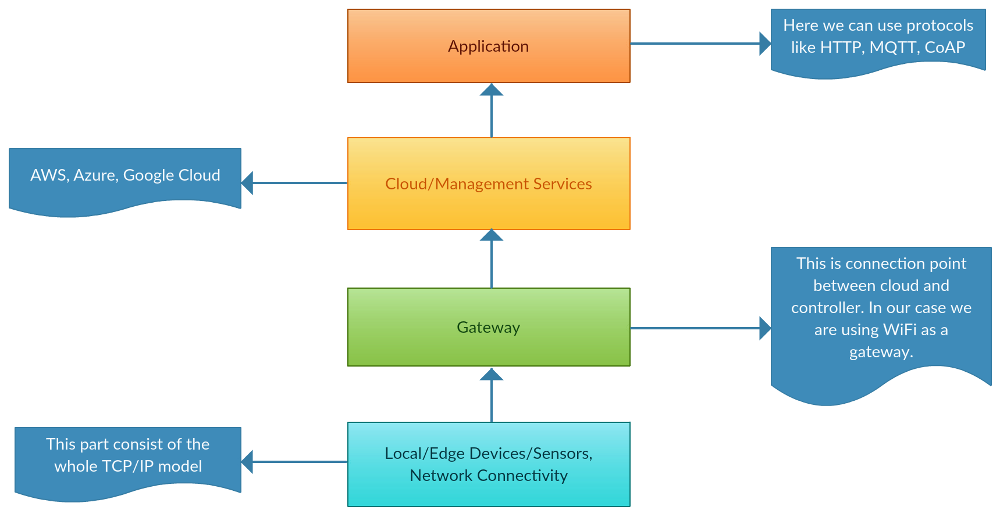

# Road_to_IoT
Collection of Arduino Sketches, I wrote after understanding the basics. Starting from LED blink ("Hello World" for ES) to glowing a bulb through Intranet (using WiFi) to many more...

### Abstract

Nowadays Internet of Things (IoT) has become a very hot topic. We can use it to control objects connected to the *Internet*, thereafter enabling us to *collect and exchange data* between objects. With its expansion in different field out of which *Home Automation* is one trend which take us one step ahead toward *smart cities*. In the proposed project(s) a system is developed which is control via *MQTT protocol*, which is a lightweight protocol for IoT. Using which we tried to achieve things like *controlling appliance from distance, generating alerts* based on the data collected. *NodeMCU* is used as a processor connecting different devices via *WiFi* channel. We tried to create a home environment and tested our prototype. First we tried it using HTML web page and then moved to application such as *MQTTBox and *Node-RED dashboard* in later part. 

***

### Designing Idea of the Product

This repository contains 3 Products altogether. Title for each of them is "Home Automation using MQTT", "Visualizing the temperature and humidity using gauge and chart", and "Server room critical temperature notifier".

***

#### Home Automation using MQTT

With coming generation come more busy schedule and this sometime lead to the fact that people forget simple things such as to switch off any appliance which is not in use. So we have made this project. Using this, one can access any electronic appliance in his/her home from anywhere given they have a proper internet connection. To just demonstrate this fact the program only demonstrate by lighting up a LED using Node-RED. This can also be done using MQTTBox. 

***

#### Visualizing the temperature and humidity using gauge and chart

**Features:**
* Contains switch for 2 lamps.
* Fan can be automated depending on the temperature.
* Visualization of Temperature and Humidity using Gauge and Chart.

***

#### Server room critical temperature notifier

* **The notifier contains three level of notification**

	* When the temperature is above 30 °C [High: Level 1 notification].
	* When the temperature is above 50 °C [Very high: Level 2 notification].
	* When the temperature is above 100 °C [Critical: Level 3 notification].

***

### Hardware required

* [LoLin NodeMCU V3](https://www.amazon.in/Centiot-ESP8266-NodeMCU-Development-Board/dp/B01M98LHT4): It is a Development Kit based on ESP8266, integates GPIO, PWM, IIC, 1-Wire and ADC all in one board. **[[Documentation](https://nodemcu.readthedocs.io/en/master/)]**
* [840 Points Bread Board](https://www.amazon.in/Generic-Elementz-Solderless-Piecesb-Circuit/dp/B00MC1CCZQ): Used to temporary prototype.
* LED: Used as a replacement for original electrical appliance.
* [DHT11](https://www.amazon.in/KitsGuru-Module-Temperature-Humidity-Arduino/dp/B00YCF0NMY): Digital temperature and humidity sensor. **[[Documentation](https://akizukidenshi.com/download/ds/aosong/DHT11.pdf)]**

***

### Software stack

* [Arduino IDE v1.8.5](https://www.arduino.cc/en/Main/Software)
* [MQTTBox v0.2.1](http://workswithweb.com/mqttbox.html)
* [Node-RED v0.18.4](https://nodered.org/docs/)

***

### Technological Background

* **OSI Layer**

The Open Systems Interconnect (OSI) is a 7 layer reference model developed by the International Organization for Standardization (ISO). It describes how information is moved from one application program running on a networked computer to an application program running on another networked computer.

Below we can see the 7 layers starting from *Physical* layer all upto *Application* layer and their function.

***

* **TCP/IP model**

In Spite of having OSI layer we do not use it as because it is totally a theoretical concept have a very little practical implementation.

By the time OSI layer was fully introduce people started using another model called *TCP/IP* model. The reason being that OSI layer is much more complex, also it emphasis more on data integrity (which is not require by many applications). 

TCP/IP model contains 5 layers. The top 3 layers of OSI model (Session, Presentation and Application layers) is combined in TCP/IP model.

***

* **IoT Architecture**

IoT architecture consist of 4 main part as depicted in the figure. Sensors in IoT device can either access the data or access it via a gateway.

For different kind of applications we have different kind of sensors such as temperature, humidity, force, ulta sonic etc.

Gateway can be either wired or wireless. One gateway can handle multiple sensors. Some widely use wireless technologies are 6LoWPAN, RFID, NFC etc. Gateway communicate with cloud using some backboned wired or wireless communication like WiFi, Fibre etc.

With increasing demand, the amount of IoT devices are growing day by day and thus to fulfil this requirement IoT supports both IPv4 as well as IPv6 protocols.

In application layer we just do the processing of data at the cloud to get the useful insights. Here we might use any protocol according to our use case. Some protocol used for IoT based devices are MQTT, CoAP, AMQP etc.

***

* **Message Queuing Telemetry Transport (MQTT)**

HTTP is most widely used protocol all over the world but due to its heavyweight property it is generally not suited for IoT based device. Here come MQTT for rescue. 

We know that most of the IoT based devices are not based on web application so it better not to use HTTP. MQTT is a data centric protocol whereas HTTP is a document centric protocol. MQTT is lightweight protocol which used publish/subscribe model, making it a perfect choice for resource-constrained devices.

MQTT is much more faster as compare to HTTP. It ensures high delivery guarantee with something called Quality of Services (QoS).

There are three levels of QoS:

1) QoS 0: at most once. It guarantees a best effort delivery. Here the message is not acknowledged by the receiver and not store by the sender again to redeliver. Sometime this is called "fire and forget".

2) QoS 1: at least once. This guarantees that the message will be delivered at least once.

3) QoS 2: exactly once. Here it is guaranteed that the message is received by the receiver only once.

More detailed explanation of QoS could be found [here](https://www.hivemq.com/blog/mqtt-essentials-part-6-mqtt-quality-of-service-levels).

**MQTT Publish/Subscribe Architecture**

Here the client (publisher) tries to **connect** to the server. After the connection is establish, the publisher **publish** message to the **broker** on certain **topic**. There are several client (subscribers) who are **subscribed** to topic of their interest. Whenever there is a new message in some topic, then the broker send the message to only one who have subscribed to that particular topic.

As already mention MQTT is ideal protocol for contrained networks. MQTT control packet consists of three parts, a fixed header, variable header and **payload**. Each packey has a 2 byte fixed header but not all packet have variable header or payload. A payload of up to 256 MB could be attached in the packet. Thus having a samll header makes it an appropriate protocol for IoT.

MQTT also provides the option of Last will & Testament and Retained messages. That means in case of unexpected disconnection of client all the subscriber will get the mesage from the broker.

For more on MQTT , you could visit there [official site](http://mqtt.org/).

***

### Algorithm - Flow Chart 

 

Here the NodeMCU is being programmed using Arduino IDE to control the LED. We connected the *ESP8266* to the Wifi using *SSID* and *password* of our home network. Here the WiFi works as a gateway for data transmission. For this we have a function called *setup_wifi()*.

Also the same ESP8266 is used as a MQTT client subscribing to the topic which is used to control the LED (electrical appliance). Here we are using a function called *setCallback()*. If a client is subscribed to a topic, then a *callback function* must be defined which is called when a new message arrive at the client.

After this we enter the *loop* where we check whether we are connected to the client. Basically we are checking if we have a connection with the MQTT broker. If not then we keep retrying else we set an interval (say 2 second). With this interval we publish the temperature and humidity reading to their respective topics. Also if some message is received in the subscribed topic then we have a check and depending on the check the LED is turned ON/OFF. This process if continue infinitely.

Similar way we have wrote code for the email notifier but here there is no subscriber. So we only have a publisher which continuously publish temperature at a particular topic. This temperature then can be check and accordingly email will be send.

***

### Node-RED Flow and Dashboard

* **For Home Automation and Visualization of temperature and humidity**

* **For Server Room Critical Temperature Notifier**

Here we have a MQTT Broker which receives message from the publisher (reading of temperature through DHT11 sensor). Now we read the received temperature reading and act accordingly. We have passed the reading through a switch which check three condition in sequence whether the temperature is above 100 °C, 50 °C or 30 °C. If any of these condition is true then we pass the signal through a *rate limiter* that keep a check that not more than 1 email is send per hour. This then passes through a function node, where we format the mail title and body which is to be send to the authority. Finally the mail is send (if it passes all the previous nodes).
***

### Demo (click on the image to get redirect to YouTube)

* **For Home Automation and Visualization of temperature and humidity**

* **For Server Room Critical Temperature Notifier**

