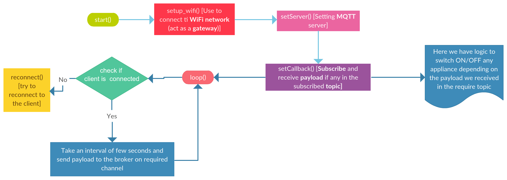

# Road_to_IoT
Collection of Arduino Sketches, I wrote after understanding the basics. Starting from LED blink ("Hello World" for ES) to glowing a bulb through Intranet (using WiFi) to many more...

### Designing Idea of the Product

This repository contains 3 Products altogether. Title for each of them is "Home Automation using MQTT", "Visualizing the temperature and Humadity using gauge and chart", and "Server room critical temperature notifier".

***

#### Home Automation using MQTT

Using this one can access any electronic appliance in his/her home from anywhere given they have a proper internet connection. To just demostrate this fact the program only demostrate by lighting up a LED using Node-RED. This can also be done using MQTTBox. 

***

#### Visualizing the temperature and Humadity using gauge and chart

**Features:**
* Contains switch for 2 lamps.
* Fan can be automated depending on the temperature.
* Visualization of Temperature and Humidity using Gauge and Chart.

***

#### Server room critical temperature notifier

* **The notifier contains three level of notification**

	* When the temperature is above 30 °C [High: Level 1 notification].
	* When the temperature is above 50 °C [Very high: Level 2 notification].
	* When the temperature is above 100 °C [Critical: Level 3 notification].

***

### Hardware required

* [LoLin NodeMCU V3](https://www.amazon.in/Centiot-ESP8266-NodeMCU-Development-Board/dp/B01M98LHT4)
* [840 Points Bread Board](https://www.amazon.in/Generic-Elementz-Solderless-Piecesb-Circuit/dp/B00MC1CCZQ)
* LED
* [DHT11](https://www.amazon.in/KitsGuru-Module-Temperature-Humidity-Arduino/dp/B00YCF0NMY)

***

### Software stack

* Arduino IDE v1.8.5
* MQTTBox v0.2.1
* Node-RED v0.18.4

***

### Algorithm Flow Chart for Home Automation and Visualization of temperature and humadity

 

***

### Node-RED Flow

* **For Home Automation and Visualization of temperature and humadity**

 

* **For Server Room Critical Temperature Notifier**

***